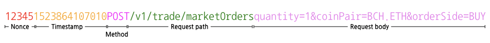

# Authentication and security policy

BITFRONT API has an authentication and security policy for user protection.
All users who want to use the API must comply with the policy.

## API KEY and API SECRET

You need API KEY and API SECRET to use BITFRON API for inquiring transaction and account-linked information.

  - APIs for simple inquiry, starting with `/v*/public` or `/v*/market/public`, do not require these credentials.
  - To gain an API KEY and an API SECRET, you must sign up to [BITFRONT](http://bitfront.me). See [Prerequisites](/1_Overview.md#prerequisites) for details.
  - API KEYs and API SECRETs are case sensitive.

> **Note**
>
> You must store these credentials in a safe place. We will not show them again for your protection. If you lose your API SECRET, you must create a new API KEY.


## Timing security

Upon receiving user requests, the API server compares the timestamp of the requests with the current timestamp in the server as a safety measure.

Requests are deemed as unsafe and rejected under the following conditions:

  - When the request timestamp is more than 1 seconds earlier than the server timestamp, the request is rejected.
  - When the time difference between the timestamps is outside the acceptable range, the request is rejected. The acceptable range varies depending on the API.
      - For cancellation requests, the time difference must be less than 10 seconds.
      - For all other requests, the time difference must be less than 5 seconds.

## RPS limit policy

The number of requests per API KEY is limited as follows:

  - Total number of API calls is allowed for 3 times per second and 60 times per minute. (Unless agreed otherwise)
      - Exception) The number of `/v2/account/tradeHistory` API call is allowed 1 time per second and 30 times per minute.
  - For orders or order cancellations, the recommended interval between requests is at least 10ms. Any interval shorter than the recommendation can result in failure.
  - Any requests exceeding the RPS limit are rejected.

## Signature policy

API requests that require API KEY must have a signature.

  - Signatures must be HMAC-SHA256 signatures, which can be constructed using user API SECRET with a concatenated string of nonce, timestamp, method, requestPath, queryString, and requestBody.

  - Nonce is the value stored in `X-API-NONCE`. Nonce must be a 5-digit arbitrary positive integer that has not been used before within the same timestamp.

  - **Timestamp is the value stored in `X-API-TIMESTAMP`, which is Unix Epoch of UTC.**

  - Method is the HTTP method of the request and must be in uppercase.

  - RequestPath is the path of the requested URI.

    For example, the requestPath is `/v1/trade/openOrders` when the URI is `https://openapi.bitfront.me/v1/trade/openOrders?market=ETH&currency=BTC&max=100`.

  - QueryString is the query parameter string of the requested URI.

    For example, the queryString is `market=ETH&currency=BTC&max=100` when the URI is `https://openapi.bitfront.me/v1/trade/openOrders?market=ETH&currency=BTC&max=100`.
    Note that “?”, the delimiter character, is excluded.

    QueryString is omissible for POST requests.

  - RequestBody is the body string of the request. It must be a string concatenation of body parameters with “&” and “=” as delimiters.

    Requestbody is omissible for GET requests.

### Generating a signature

These examples show how to generate a signature and send a request using the generated signature.

These examples use the following data:

| **Item**   | **Value**                        |
| :--------- | :------------------------------- |
| API KEY    | 6W206egN32nCQ0VB                 |
| API SECRET | dwjnGqCVzfHlW6Q9r4BjXpmiK1WCdMBI |
| Timestamp  | 1523864107010                    |
| Nonce      | 12345                            |

**Example 1: Query string**

In this example, the request passes parameters as a query string.
The API for the example is as follows:

| **Item**     | **Value**                          |
| :----------- | :--------------------------------- |
| HTTP Method  | GET                                |
| Request path | `/v1/trade/openOrders`             |
| Parameters   | `market`: ETH, `currenty`: BTC, `max`: 100 |

The target string for the signature is as follows:


In LINUX, generate the HMAC-SHA256 signature by using the `echo` and `openssl` commands.

``` bash
echo -n "123451523864107010GET/v1/trade/openOrdersmarket=ETH&currency=BTC&max=100" \
  | openssl dgst -sha256 -hmac "dwjnGqCVzfHlW6Q9r4BjXpmiK1WCdMBI"
(stdin)= f6f55e74ebe513b5c5b26a1c056923ce7a8dd56c0ea890d22fa603688b28ace0
```

Next, send an API request including the signature by using the `curl` command.

``` bash
curl --header "X-API-KEY: 6W206egN32nCQ0VB" \
     --header "X-API-SIGN: f6f55e74ebe513b5c5b26a1c056923ce7a8dd56c0ea890d22fa603688b28ace0" \
     --header "X-API-TIMESTAMP: 1523864107010" \
     --header "X-API-NONCE: 12345" \
     --header 'content-type: application/x-www-form-urlencoded' \
     -X GET '/v1/trade/openOrders?market=ETH&currency=BTC&max=100' \
```

**Example 2: Request body**

In this example, the request passes parameters as a body string.
The API for the example is as follows:

| **Item**     | **Value**                                            |
| :----------- | :--------------------------------------------------- |
| HTTP Method  | POST                                                 |
| Request path | `/v1/trade/marketOrders`                             |
| Parameters   | `quantity`: 1, `coinPair`: BCH.ETH, `orderSide`: BUY |

The target string for the signature is as follows:



In LINUX, generate the HMAC-SHA256 signature by using the `echo` and `openssl` commands.

``` bash
echo -n "123451523864107010POST/v1/trade/marketOrdersquantity=1&coinPair=BCH.ETH&orderSide=BUY" \
  | openssl dgst -sha256 -hmac "dwjnGqCVzfHlW6Q9r4BjXpmiK1WCdMBI"
(stdin)=03838b25c336e0a6fb3617b9b07c9da9d91d96ab0e61598aa7e6cd1396b2b3ef
```

Next, send an API request including the signature by using the `curl` command.

``` bash
curl --header "X-API-KEY: 6W206egN32nCQ0VB" \
     --header "X-API-SIGN: 03838b25c336e0a6fb3617b9b07c9da9d91d96ab0e61598aa7e6cd1396b2b3ef" \
     --header "X-API-TIMESTAMP: 1523864107010" \
     --header "X-API-NONCE: 12345" \
     --header 'content-type: application/x-www-form-urlencoded' \
     -X POST 'https://openapi.bitfront.me/v1/trade/marketOrders' \
     --data 'quantity=1&coinPair=BCH.ETH&orderSide=BUY'
```
